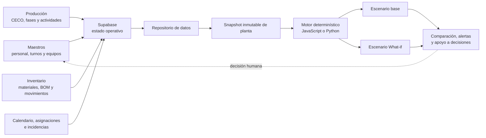
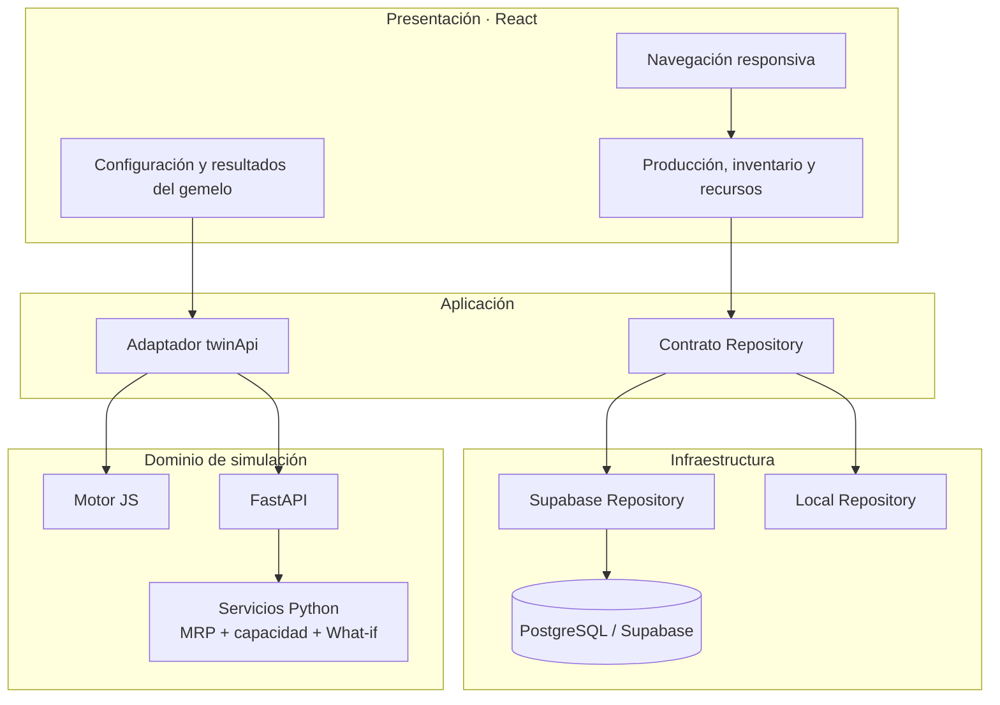
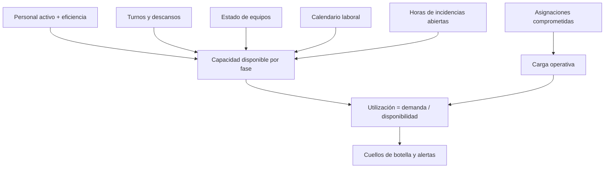

# Arquitectura del gemelo digital ETRAL

## Flujo operativo

Los formularios mantienen el estado real. La simulación recibe una copia de ese estado y nunca modifica directamente los registros operativos.

## Arquitectura lógica

## Patrones de diseño utilizados

### Repository

`getRepository()` selecciona la implementación de persistencia. Los componentes trabajan con operaciones de negocio y no con consultas SQL o tablas concretas.

### Strategy

`VITE_TWIN_ENGINE` selecciona el motor `browser` o `python`. Ambos entregan el mismo contrato de resultados al frontend.

### Adapter

`twinApi.js` transforma el dataset de React en el snapshot esperado por FastAPI y adapta la respuesta del motor a la interfaz.

### Service Layer

`backend/app/services.py` concentra MRP, stock de seguridad, capacidad y comparación de escenarios. Las rutas FastAPI solo validan y delegan.

### DTO / Schema

Los modelos Pydantic validan materiales, órdenes, recursos, equipos, calendario e incidencias antes de ejecutar una simulación.

### Snapshot

Cada corrida usa una fotografía aislada del estado de planta. Esto garantiza reproducibilidad y evita que un escenario altere inventario, CECO o asignaciones reales.

## Alimentación de capacidad

El motor es determinístico y auditable. No usa machine learning: cada resultado se deriva de datos registrados, reglas MRP y fórmulas explícitas.
