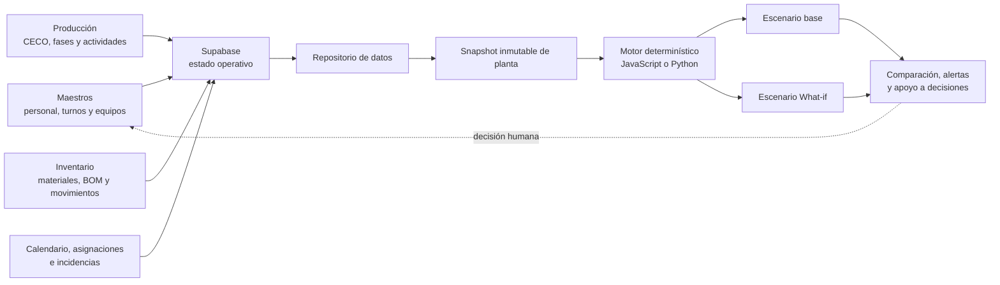
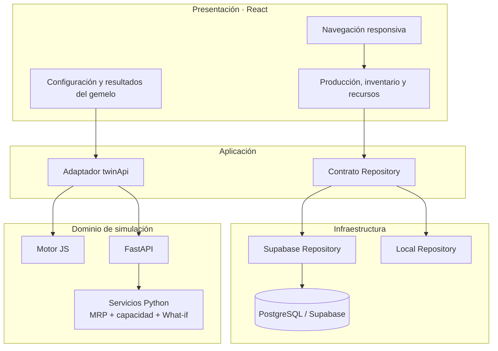
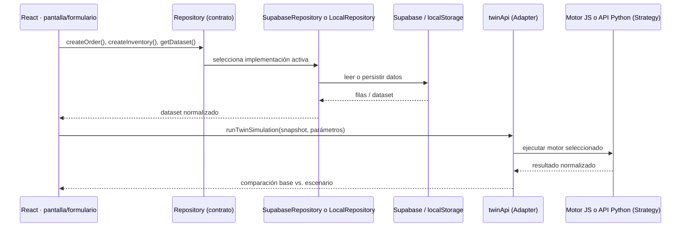
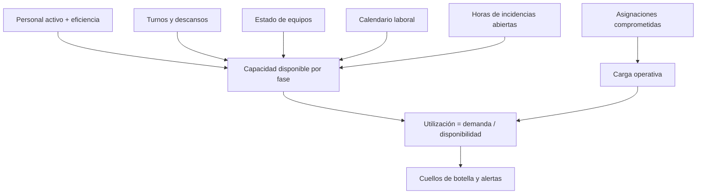

# Arquitectura del gemelo digital ETRAL

## Flujo operativo

Los formularios mantienen el estado real. La simulación recibe una copia de ese estado y nunca modifica directamente los registros operativos.

## Arquitectura lógica

## Patrones de diseño utilizados

### Diagrama de los patrones en una acción del front

### Repository

`getRepository()` selecciona la implementación de persistencia. Los componentes trabajan con operaciones de negocio y no con consultas SQL o tablas concretas.

**Aplicación en el front:** `App.jsx` solicita un único dataset y llama métodos como `createInventory`, `createOrder` o `createCatalogItem`. No conoce si los datos vienen de Supabase o de `localStorage`.

### Strategy

`VITE_TWIN_ENGINE` selecciona el motor `browser` o `python`. Ambos entregan el mismo contrato de resultados al frontend.

**Beneficio:** se puede usar el cálculo ligero de JavaScript para una demostración o la API Python para reglas de simulación más avanzadas, sin cambiar las pantallas.

### Adapter

`twinApi.js` transforma el dataset de React en el snapshot esperado por FastAPI y adapta la respuesta del motor a la interfaz.

**Beneficio:** el formato interno de la API no se filtra a los componentes React.

### Service Layer

`backend/app/services.py` concentra MRP, stock de seguridad, capacidad y comparación de escenarios. Las rutas FastAPI solo validan y delegan.

### DTO / Schema

Los modelos Pydantic validan materiales, órdenes, recursos, equipos, calendario e incidencias antes de ejecutar una simulación.

### Snapshot

Cada corrida usa una fotografía aislada del estado de planta. Esto garantiza reproducibilidad y evita que un escenario altere inventario, CECO o asignaciones reales.

## Alimentación de capacidad

El motor es determinístico y auditable. No usa machine learning: cada resultado se deriva de datos registrados, reglas MRP y fórmulas explícitas.

## Responsabilidad por capa

| Capa | Responsabilidad | Ejemplos |
|---|---|---|
| Presentación | Captura y muestra la operación. | Formularios, Kanban de CECO, inventario, fases, resultados del gemelo. |
| Aplicación | Coordina acciones y normaliza datos. | `App.jsx`, `repository.js`, `twinApi.js`. |
| Persistencia | Lee y escribe el estado operativo. | `supabaseRepository.js`, `localRepository.js`. |
| Dominio | Calcula reglas y escenarios sin alterar la operación real. | MRP, capacidad, alertas y simulación What-if. |
| Datos | Conserva maestros y transacciones. | PostgreSQL/Supabase y sus relaciones. |
