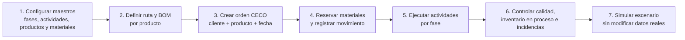
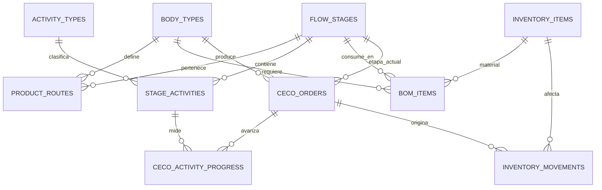
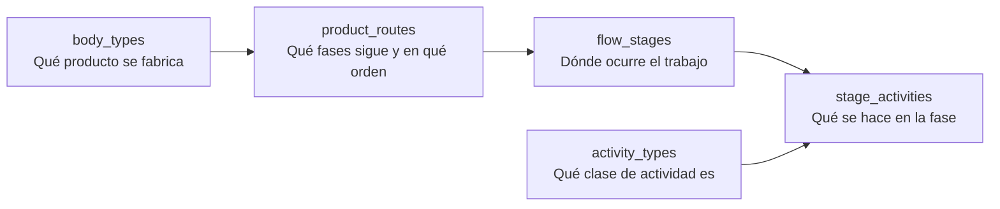

# Modelo de datos y flujo operativo ETRAL

Este documento resume para qué sirve cada tabla, su relación y qué pantalla del frontend la utiliza. El esquema fuente está en `src/supabase/schema.sql`.

## Flujo de negocio

| Paso | Datos involucrados | Uso en el front |
|---|---|---|
| Configuración | Catálogos, fases, actividades, productos, recursos. | Formularios de nuevo material, producto, actividad y panel de fases. |
| Preparación | Ruta de producto y BOM. | Ruta de fabricación y panel BOM. |
| Orden | CECO, producto, etapa actual y prioridad. | Producción, Kanban y detalle del CECO. |
| Materiales | Inventario, reservas, salidas y movimientos. | Inventario, kardex y cobertura MRP. |
| Ejecución | Actividades, avance, horas, WIP, calidad. | Detalle de CECO y fase actual. |
| Simulación | Snapshot de todos los datos operativos. | Pantalla Simulación. |

## Relaciones principales

## Tablas de maestros

| Tabla | Para qué sirve | Relación / uso en el front |
|---|---|---|
| `material_categories` | Catálogo de categorías de material. | `inventory_items.category_id`; selector y mini mantenedor de Categoría. |
| `measurement_units` | Catálogo de unidades y símbolos. | `inventory_items.unit_id`; selector y mini mantenedor de Unidad de medida. |
| `brands` | Catálogo de marcas. | `inventory_items.brand_id`; selector y mini mantenedor de Marca. |
| `activity_types` | Clasifica una actividad: operación, inspección, transporte, etc.; incluye su símbolo de diagrama. | `stage_activities.activity_type_code`. Aún no se muestra directamente en el front; queda listo para un DOP o filtro por tipo. |
| `flow_stages` | Fases globales de planta, con orden, capacidad, color y control de calidad. | Contiene actividades y forma las rutas. Se muestra en Fases y actividades, Producción, BOM y detalle CECO. |
| `stage_activities` | Actividades ordenadas dentro de una fase, con tiempo estándar. | Se ven en Fases y actividades y en el detalle de cada CECO; se crean con “Añadir actividad”. |
| `body_types` | Maestro de productos/carrozados: código, familia, nombre, días objetivo y unidad de salida. | Selector de producto en CECO y BOM; se administra al registrar un producto. |
| `work_shifts` | Turnos laborales y horas disponibles. | Alimenta la simulación de capacidad; no tiene mantenedor visual independiente. |
| `personnel` | Personal, eficiencia y turno asignado. | Pantalla/flujo de recursos y asignaciones; alimenta capacidad. |
| `equipment` | Equipos por fase, con capacidad y estado. | Alimenta restricciones de capacidad e incidencias. |
| `work_calendar` | Días laborables, feriados y horas de trabajo. | Alimenta el cálculo de capacidad y horizonte de simulación. |

## Tablas de relación y operación

| Tabla | Para qué sirve | Relación / uso en el front |
|---|---|---|
| `product_routes` | Define qué fases recorre cada producto y en qué secuencia. | Une `body_types` con `flow_stages`. Al crear producto se marcan sus fases; al avanzar CECO se toma la siguiente fase. |
| `inventory_items` | Existencias de cada material: físico, comprometido, seguridad, unidad y ubicación. | Maestro de materiales, disponibilidad, proyección y alertas MRP. |
| `bom_items` | Lista de materiales requeridos por producto y fase de consumo. | Panel BOM y materiales requeridos en el detalle del CECO. |
| `ceco_orders` | Orden de producción: CECO, cliente, producto, etapa actual, avance, prioridad y fecha. | Kanban, tabla de Producción y pasaporte productivo. |
| `stage_inventory` | Inventario en proceso por fase y CECO. | Bloque “Inventario en proceso” en Fases y actividades. |
| `ceco_activity_progress` | Estado y porcentaje de una actividad para un CECO. | Actividad actual, avance y detalle del CECO. |
| `resource_assignments` | Asigna una persona y horas planificadas a un CECO y actividad. | Formulario de asignación; entrada para capacidad comprometida. |
| `operational_incidents` | Incidencias que afectan fase, CECO o equipo y horas perdidas. | Entrada para alertas y para restar capacidad de la simulación. |
| `operation_logs` | Registro de horas ejecutadas por responsable y CECO. | Parte diario de ejecución. |
| `warehouse_exits` | Vale/ticket de salida de material para una orden. | Trazabilidad de salidas de almacén. |
| `quality_checks` | Resultado de inspección por CECO y fase. | Estado de calidad en el detalle del CECO. |
| `inventory_movements` | Kardex: ingresos, salidas, reservas, ajustes y consumos. | Tabla Kardex en Inventario. |
| `simulation_runs` | Historial opcional de ejecuciones del gemelo y sus parámetros/resultados. | El front actual presenta el resultado en sesión; esta tabla permite persistir auditoría futura. |

## Lectura rápida de las cinco tablas de producción

- `body_types`: el producto, por ejemplo un furgón o una cisterna.
- `product_routes`: la ruta específica de ese producto.
- `flow_stages`: las estaciones/fases disponibles de la planta.
- `stage_activities`: el trabajo concreto dentro de una fase.
- `activity_types`: la clasificación visual y funcional de una actividad.
